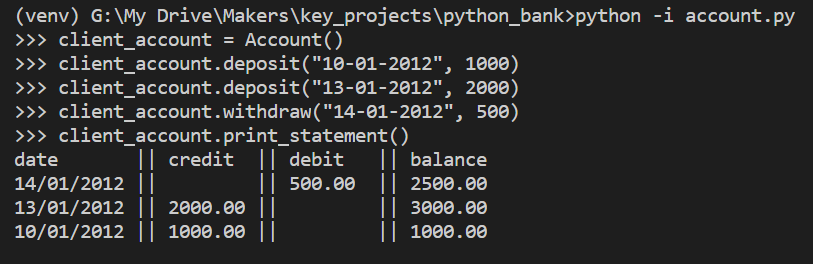
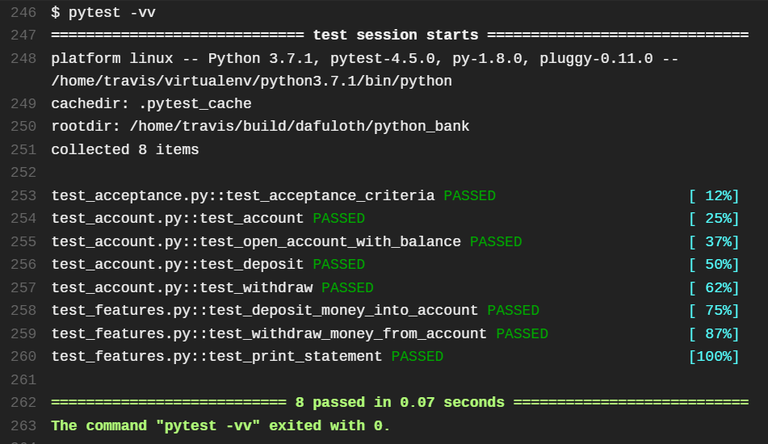
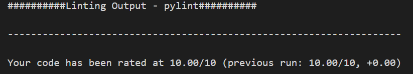

# Bank Tech Test in Python

This is a solution by TDD for the Bank Tech Test in `Python`, with `pytest` for tests and `pylint` for code quality & linting. 

Source: <https://github.com/makersacademy/course/blob/master/individual_challenges/bank_tech_test.md>

*Requirements* and *Acceptance Criteria* copied from source text

## The Feature Test

This is the result of running the [Acceptance Criteria](#acceptance-criteria) on the finished solution:

## Python Versions

This was developed in Python 3.7(.3)

## Running the tests
Every new push triggers Travis CI to build and run tests. Here is output showing 100% tests passing:

To run tests yourself, clone the repository and ensure you have `pytest`, or run `pip install -r requirements.txt` with the `requirements.txt` file (created via `pip freeze > requirements.txt`). Then you can run `pytest`

## Code quality

I used `pylint` to for linting and checking code quality:

## Specification

### Requirements

* Interact with code via a REPL like IRB, no need for CLI to take input from STDIN

* Deposits, withdrawal.

* Account statement (date, amount, balance) printing.

* Data can be kept in memory (it doesn't need to be stored to a database or anything).

### Acceptance criteria

1. Given a client makes a deposit of 1000 on 10-01-2012
2. And a deposit of 2000 on 13-01-2012
3. And a withdrawal of 500 on 14-01-2012  
4. When she prints her bank statement, then she would see:

        date       || credit  || debit  || balance
        14/01/2012 ||         || 500.00 || 2500.00
        13/01/2012 || 2000.00 ||        || 3000.00
        10/01/2012 || 1000.00 ||        || 1000.00

### User Stories

    As a client
    I want to keep my money safe
    So I deposit the money into my account

    As a client
    I want to be able to spend my money
    So I make a withdrawal from my account

    As a client
    I want to keep track of my money
    So I print my bank statement, showing transactions by date and resulting balances

### Domain Modelling

    Class: Account

    Properties: balance
                transaction_log

    Methods:  deposit(date, amount)
              withdraw(date, amount)
              print_statement()
